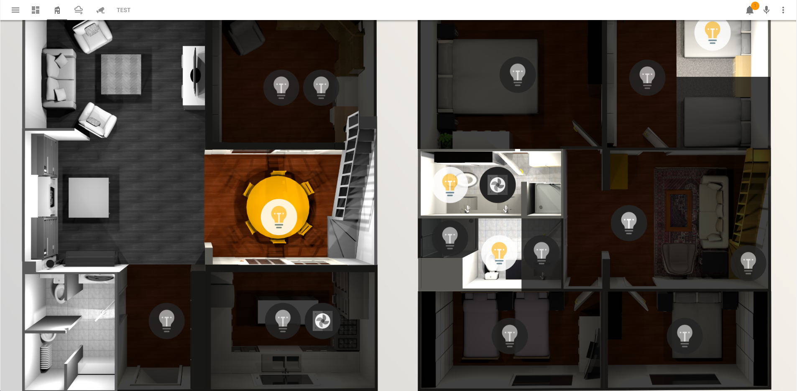
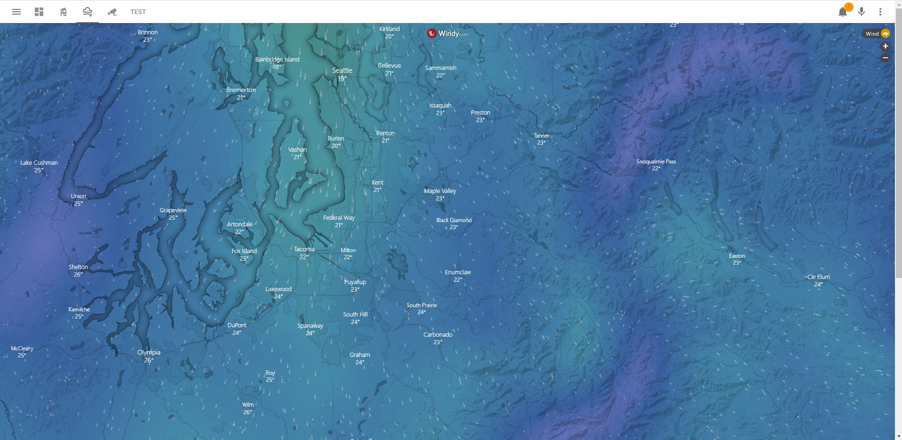

# Floorplan-IoT-Homeassistant

## About The Project
An interactive floorplan integrated into [HomeAssistant](https://www.home-assistant.io/) that allows you to control a multitude of IoT devices through tapping on sections of the floor plan. The gif above shows an example of how lights in a house can be controlled through tapping on predetermined sections of the floorplan. Graphics and models of a house were made using [Sweet Home 3D](http://www.sweethome3d.com/), a free architectural design software. 

## Interfaces of the Dashboard
### Main Floorplan Screen

___

### Weather Dashboard
Using [Windy.com](https://www.windy.com/)

___

### File Locations
* Dashboard layout code can be found in 'lovelace' in the root directory
* Source files for the floorplan can be found in /www
* Scripts.yaml, Auomations.yaml, and Groups.yaml control the behaviour of respective IoT devices connected to HomeAssistant
* configuration.yaml is omitted due to private API keys and MAC addresses
